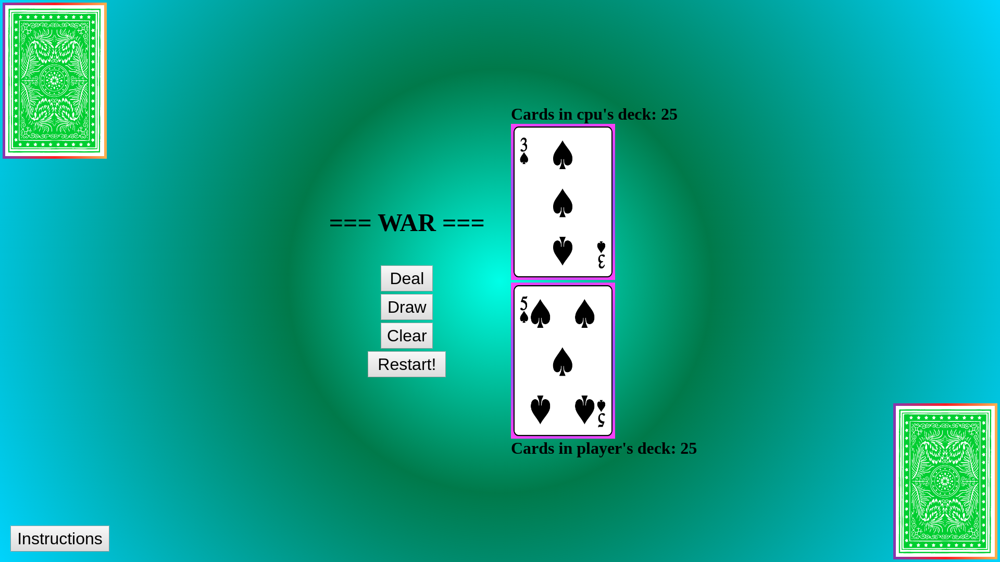

# Project-0
The game
// == User Stories/game logic == //

User presses start button and the back of the cards appear in the deck pile on each players' sides, below the deck pile there is a count with the number of cards remaining. When the user clicks on their deck, the number remaining goes down, a random card is moved to the card in play "pile", [after a second or so] - changed to a clear button - the cards values are compared against each other, and moved to the bottom of the winners deck. The game ends when one player is out of cards.

Comparing the cards: 
- If the cards in play have the same value, then the player and computer must draw THREE more cards and the last card drawn for each will be evaluated for a win
- Otherwise the card with the highest value wins the battle.

Initial Game Logic: 
- on click function maybe calls another function to begin
- create card class
- build deck
- deal cards to cpu and player

- on clicking the deck, move card from hand into cards being played, and display it face up
- maybe wait a second or two while displaying the cards in play
- depending on who's card value is higher, move the pair of cards in play to the bottom of the winners deck

- if one hand is 0 then they lose and the game is over

Stretch goal:
- displaying all of the cards in a war instead of just stacking them on the cards in play

MVP: 
- 4 cards on screen, two representing the cpu and player's hands, and two representing the cards in play, user is able to press start to begin game, then draw to select the top card of their deck and press the clear button to find the card with the higher value.

Game Rules: 
- Welcome to War, a classic two player card game. Today you will be playing againstthe computer! Your goal in the game is to reduce the number of cards in your opponent's deck to 0 before they do the same to you. Each player turns up a card at the same time and the player with the higher card takes both cards and puts them, face down, on the bottom of his stack. If the cards are the same rank, it is War. Each player turns up one card face down and one card face up. The player with the higher cards takes both piles (six cards).
Game Instructions:
- To start the game click the Deal button to split, and shuffle the deck into each of your hands. Next, click the Draw button to draw a card and play it. Clear will move the cards to the winner's hand, but if there is a war an alert will pop up and 3 more cards will be drawn; press clear again after the war cards are distributed to clear the 6 cards to the winner.

Start Screen:

Instructions Page:

In-Game:
